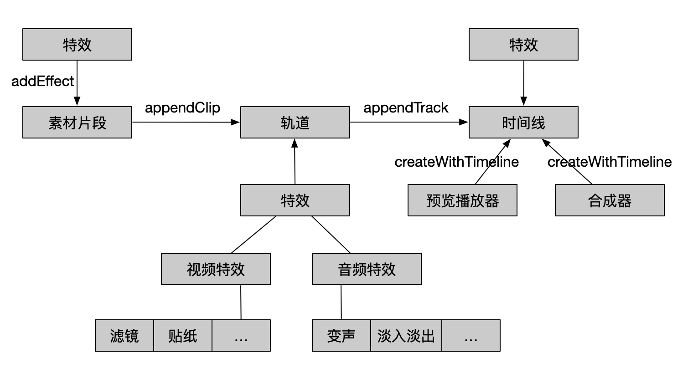

#iOS剪辑SDK接入文档

## 1. 概述
海燕（petrel）是360推出的首家免费短视频开源项目，涵盖了iOS、Android等平台。为开发者提供短视频拍摄、剪辑等全套解决方案。

剪辑SDK定位以市场为导向,助推短视频行业发展，为开发者提供编辑、特效、预览播放、合成全流程解决方案，开发者可以根据自己的创意创建App，实现各种特色功能。

### 1.1 产品特点
**支持多轨道、多段编辑**

* 支持同时导入不同格式的视频、图片，进行多段混剪
* 支持多轨道，能够满足画中画、分屏、配音等多种玩法

**支持多种输入、输出样式**

支持多种格式、多种分辨率的输入素材，素材既可以是本地的也可以是云端url地址，同时开发者可以根据需求自定义输出分辨率。

**所见即所得**

通过预览播放器可以在制作过程中实时预览制作效果，大大提高了制作体验，节省了制作成本和时间

**丰富的基础编辑功能**

剪辑SDK包含丰富的基础编辑功能，开发者可以根据自己的需求灵活组合使用。

**支持自定义特效**

特效完全插件化，开发者还可以根据需要扩展自定义特效。

**核心功能列表及说明**

| 功能 | 说明 |
| --- | --- |
| 多段素材拼接、文件剪切 | 将多段视频素材拼接一个文件，并且支持剪切头部尾部冗余的视频，或者文件片段 |
| 画面裁剪、旋转、缩放、水平/垂直镜像 | 对视频画面进行裁剪，旋转角度，扩大缩小，镜像等操作，达到最佳视觉体验 |
| 缩略图 | 实时获取文件缩略图，精确到帧画面，方便剪辑预览 |
| 音视频分离 | 分离音视频，获取单独的音频或者视频与其他素材进行叠加 |
| 画中画 | 叠加不同的视频素材，实现画中画的效果，例如分屏、9宫格画面 |
| 转场 | 相邻文件衔接处添加转场效果，起到平滑过渡的作用，为客户提供20余种效果进行选择。 |
| 倍速 | 无级慢速、快速调节，支持1/8-8b倍速 |
| 调节音量、声音添加缓入缓出效果 | 针对音频文件调节音量，声音支持缓入缓出循循渐进的效果，波浪状的音轨。 |
| 变声 | 调节音调，实现不同的声音效果，例如男生变女生。 |
| 添加字幕、贴纸、水印 | 添加字幕、贴纸、水印丰富视频内容 |
| 添加滤镜 | 添加不同滤镜效果，快速替换风格，目前提供17种滤镜效果，同时支持自定义 |
| 实时背景音乐 | 添加背景音乐与原音进行混合 |
| 马赛克 | 针对原视频打马赛克，例如遮盖品牌及广告logo |

### 1.2 输入输出规范

**输入规范：**

* 视频格式：MP4、MOV、WMV、M2V、MPG
* 音频格式：MP3、FLAC、AAC、M4A
* 图片格式：JPG、PNG、HEIC
* 视频编码：H264、H265、WMV、MPEG4
* 音频编码：MP3、AAC、PCM、FLAC

**输出规范：**

* 视频格式：MP4
* 视频编码：H264
* 音频编码：AAC

**第三方库：**

* ffmpege 3.4 及以上

### 1.3 系统版本

系统版本：iOS 8.0及以上

### 1.4 运行环境

请在真机上运行，暂不支持模拟器版本

## 2. 使用说明

**头文件说明**

剪辑SDK分为两个framework：

* 基础框架 : QHVCEditKit.framework

```code
#import <QHVCEditKit/QHVCEditKit.h>           //头文件列表

#import <QHVCEditKit/QHVCEditCommonDef.h>     //通用配置、枚举
#import <QHVCEditKit/QHVCEditTimeline.h>      //时间线
#import <QHVCEditKit/QHVCEditTrack.h>         //轨道
#import <QHVCEditKit/QHVCEditTrackClip.h>     //素材
#import <QHVCEditKit/QHVCEditEffect.h>        //特效
#import <QHVCEditKit/QHVCEditPlayer.h>        //预览播放器
#import <QHVCEditKit/QHVCEditProducer.h>      //合成器
#import <QHVCEditKit/QHVCEditThumbnail.h>     //缩略图

```

* 基础特效 : QHVCEffectKit.framework

```code
#import <QHVCEffectKit/QHVCEffect.h>              //基础特效
#import <QHVCEffectKit/QHVCEffectBase.h>          //特效基类
#import <QHVCEffectKit/QHVCEffectBase+Process.h>  //特效处理扩展类
```

**使用流程**

实现视频编辑的一般步骤：
1.	 创建时间线
2. 添加轨道
3. 添加文件片段
4. 添加特效
5. 添加实时预览播放器
6. 合成媒体文件
其中，4、5顺序可颠倒，实时预览、合成器均可单独使用。


**注意事项**

剪辑SDK内所有时间单位均为毫秒

### 2.1 创建时间线

时间线是剪辑SDK的入口，是剪辑SDK的上下文。在使用剪辑SDK时，需要先初始化QHVCEditTimeline类，不再使用时释放QHVCEditTimeline类对象，请务必保证不要在剪辑过程中销毁QHVCEditTimeline类对象！

**2.1.1 创建时间线**

```code
self.timeline = [[QHVCEditTimeline alloc] initTimeline];
```
**2.1.2 设置输出分辨率**

创建时间线时，需要预先设置输出分辨率，合成和预览效果都会依赖输出分辨率。其他输出参数可根据用户需求自定义配置。

```code
[self.timeline setOutputWidth:outputSize.width height:outputSize.height];
```

**2.1.3 销毁时间线**

```code
[self.timeline free];
```

### 2.2 轨道操作

轨道是文件素材（TrackClip）的载体，也就是文件列表。
视频轨道上可以添加视频、图片文件；音频轨道上能添加音频、视频文件，音频轨道上添加视频文件时只会处理音频部分。
同一轨道上的文件间不能重叠，否则后添加的文件无法添加成功。

**2.2.1 视频顺序轨道**

一般情况下创建一条视频顺序轨道作为主视频轴。顺序轨道内的素材（clip）是依次顺序排列的，轨道内素材操作依赖素材下标或素材ID来操作。

* 创建轨道

```code
self.mainTrack = [[QHVCEditSequenceTrack alloc] initWithTimeline:self.timeline 
type:QHVCEditTrackTypeVideo];
```

* 轨道添加到时间线内

```code
[self.timeline appendTrack:self.mainTrack];
```

* 释放轨道

```code
[self.mainTrack free];
```

**2.2.2 视频画中画轨道**

一般情况下，一个素材对应一条画中画轨道，素材可被添加至轨道任意时间点，轨道内素材操作都依赖素材ID来操作。

* 创建轨道

```code
QHVCEditOverlayTrack* overlayTrack = [[QHVCEditOverlayTrack alloc] initWithTimeline:self.timeline 
type:QHVCEditTrackTypeVideo];
```

* 轨道添加到时间线内

```code
[self.timeline appendTrack:overlayTrack];
```

* 释放轨道

```code
[overlayTrack free];
```

**2.2.3 音频轨道**

音频轨道多用来添加背景音乐，可根据用户场景具体来定是使用顺序轨道还是画中画轨道。

* 创建轨道

```code
self.mainAudioTrack = [[QHVCEditOverlayTrack alloc] initWithTimeline:self.timeline
 type:QHVCEditTrackTypeAudio];
```

* 轨道添加到时间线内

```code
[self.timeline appendTrack:self.mainAudioTrack];
```

* 释放轨道

```code
[self.mainAudioTrack free];
```

**2.3.4 转场操作**

只有顺序轨道可以添加转场。AB两个素材间添加转场，clipIndex为B的索引。

* 添加转场

```code
[self.mainTrack addVideoTransitionToIndex:index 
 duration:duration
 videoTransitionName:transitionName
 easingFunctionType:easingFunctionType];
```

* 更新转场

```code
[self.mainTrack updateVideoTransitionAtIndex:index
 duration:duration
 videoTransitionName:transitionName
 easingFunctionType:easingFunctionType];
```

* 删除转场

```code
[self.mainTrack deleteVideoTransition:index];
```

### 2.3 文件片段操作

图片、视频素材都是通过文件路径添加到轨道上的。文件素材目前需先拷贝至沙盒再添加。

**2.3.1 创建素材**

```code
//初始化
QHVCEditTrackClip* clip = [[QHVCEditTrackClip alloc] initClipWithTimeline:self.timeline];

//设置路径
[clip setFilePath:item.filePath type:QHVCEditTrackClipTypeVideo];

//设置起止时间
[clip setFileStartTime:0];
[clip setFileEndTime:3000];
```

**2.3.2 添加素材至轨道**

* 添加至顺序轨道末尾

```code
[self.mainTrack appendClip:clip];
```

* 添加至顺序轨道任意位置

```code
[self.mainTrack insertClip:clip atIndex:2];
```

* 添加至画中画轨道任意时刻

```code
[self.overlayTrack addClip:clip atTime:0];
```

**2.3.3 更新素材属性**

```code
[self.mainTrack updateClipParams:clip];
```

**2.3.4 删除素材**

* 根据素材ID删除

```code
[self.mainTrack deleteClipById:clipId];
```

* 根据素材下标删除，仅限添加至顺序轨道的素材

```code
[self.mainTrack deleteClipAtIndex:2];
```

### 2.4 特效操作

**2.4.1 创建特效**

所有特效都继承QHVCEditEffect类，不同特效有各自不同的属性，详见各效果接口说明。此处以滤镜为例。

```code
//初始化
self.effect = [[QHVCEditFilterEffect alloc] initEffectWithTimeline:self.timeline];

//设置查色图文件路径
[filter setFilePath:path];

//设置开始时间，相对特效被添加的对象
[filter setStartTime:0];

//设置结束时间
[filter setEndTime:3000];
```

**2.4.2 添加特效**

根据用户需求，特效可被添加至时间线、轨道、素材任意时间段内。

```code
 //添加至时间线
 [self.timeline addEffect:effect];
 
 //添加至轨道
 [self.track addEffect:effect];
 
 //添加至素材
 [self.clip addEffect:effect];
```

**2.4.3 更新特效**

特效属性修改后，需显式更新。

```code
//时间线更新特效
[self.timeline updateEffect:effect];

//轨道更新特效
[self.track updateEffect:effect];

//素材更新特效
[self.clip updateEffect:effect];
```

**2.4.4 删除特效**

```code
//时间线删除特效
[self.clip deleteEffectById:effectId];

//轨道删除特效
[self.track deleteEffectById:effectId];

//素材删除特效
[self.clip deleteEffectById:effectId];
```

### 2.5 预览播放器

预览播放器和传统播放器相比，具备实时预览效果，所有添加的特效都可以通过预览播放器实时渲染。预览过程中，特效并没有真正添加进素材文件内。

*此处仅展示预览播放器基本功能，更多功能详见播放器接口。*

**2.5.1 创建预览播放器**

预览播放器需要设置预览画布，预览播放器会根据时间线输出分辨率来处理数据帧，为保证体验，建议预览画布尺寸和输出分辨率保持相同的宽高比。

```code
//初始化
QHVCEditPlayer* player = [[QHVCEditPlayer alloc] initWithTimeline:self.timeline];

//设置代理
[player setDelegate:delegate];

//设置预览画布
[player setPreview:view];
```

**2.5.2 释放预览播放器**

请务必保证播放器相关方法在释放前调用。
```code
[self.player free];
```

**2.5.3 定位操作**

* 播放器可以seek至时间线内任意时间点，满足精确seek需求。
* 定位操作分为强制、非强制两种，强制seek保证一定会seek到请求的时间点，反之非强制seek不保证。
* 为保证体验和效率，建议多次连续seek时，尽量使用非强制seek，最后一次请求使用强制方式。

```code
[self.player playerSeekToTime:0 forceRequest:NO complete:nil];
```

**2.5.4 刷新操作**

* 播放器初始化之后，若有效果变动需显式刷新播放器，例如添加、删除、修改等操作
* 刷新请求分为强制、非强制两种，强制刷新保证一定会更新效果，反之请求可能会被忽略
* 为保证体验和性能，建议多次连续刷新时，尽量使用非强制刷新，最后一次请求使用强制刷新
* 为保证体验和性能，若有特效添加或删除，forBasicParams置为true, 更新特效属性该参数为false

```code
[self.player refreshPlayer:true forceRefresh:true completion:nil];
```

|需刷新播放器的场景：      |
|-----------------------|
|修改转场样式、缓动函数类型（forBasicParams：false） |
|添加、删除特效（forBasicParams：true）|
|修改特效（forBasicParams：false）|
|调节音量（forBasicParams：true）|

**2.5.5 重置操作**

* 播放器初始化之后，若有轨道、素材相关操作需重置播放器
* 重置操作支持重置并定位到时间线的某个时间点

```code
[self.player resetPlayer:currentTime];
```

|需重置播放器的场景：       |
|-----------------------|
|添加、删除轨道           |
|添加、删除、移动素材|
|变速                    |
|变调                    |
|添加、删除转场，修改转场时长|

### 2.6 合成操作

合成器会读取素材文件，并按特效指令处理素材文件，最终按照配置合成新的媒体文件。
开始合成前，请务必保证合成输出文件所在目录已存在。

**2.6.1 初始化**

```code
self.producer = [[QHVCEditProducer alloc] initWithTimeline:self.timeline];
[producer setDelegate:self];
```

**2.6.2 释放**

清除合成过程中生成的缓存数据，不会清除合成输出的文件。
请务必保证所有合成操作在释放前进行。

```code
[self.producer free];
```

**2.6.3 开始合成**

开始合成后，会在回调函数里返回当前进度或异常。

```code
[self.producer start];
```

**2.6.4 取消合成**

用于合成打断操作，无需在合成结束后额外调用。

```code
[self.producer stop];
```

### 2.7 其他

**2.7.1 缩略图**

用于源文件抽帧操作，支持获取某个时间点，或指定任意时间段内指定数量的缩略图。

* 初始化

```code
self.thumbnail = [[QHVCEditThumbnail alloc] init];
```

* 释放

会清除获取缩略图过程中的缓存数据

```code
[self.thumbnail free];
```

* 获取单张

支持指定返回图的尺寸，会根据设定的尺寸按源素材尺寸等比缩放处理。

```code
[self.thumbnail requestThumbnailFromFile:filePath 
width:size.width 
height:size.height 
timestamp:timeMs 
dataCallback:nil];
```

* 批量获取

支持指定返回图的尺寸，会根据设定的尺寸按源素材尺寸等比缩放处理。
支持指定获取任意时间段内任意个数的缩略图，会根据个数在时间段内均匀取图。
为保证体验，会多次触发回调函数及时返回缩略图。

```code
[_thumbnail requestThumbnailFromFile:filePath
 width:size.width 
 height:size.height 
 startTime:startMs
 endTime:endMs
 count:count
 dataCallback:nil];
```

## 错误码

**基本错误码：**

|状态码|字段           |注释|
|:---:|---------------|---|
|0|QHVCEditErrorNoError|无错误|
|1|QHVCEditErrorParamError|参数错误|
|2|QHVCEditErrorAlreayExist|已存在|
|3|QHVCEditErrorNotExist|不存在|
|100|QHVCEditErrorRequestThumbnailError|获取缩略图错误|
|200|QHVCEditErrorInitPlayerError|初始化播放器错误|
|201|QHVCEditErrorPlayerStatusError|播放器状态错误|
|300|QHVCEditErrorInitProducerError|初始化合成器错误|
|301|QHVCEditErrorProducerHandleIsNull|合成器句柄为空|
|302|QHVCEditErrorProducingError|合成中出错|

**详细错误码：**
	
|模块| 状态码 | 注释        |
|--- |-----|------------|
|通用| -999  | 内存分配失败 |
|| -998  | 文件打开失败 |
|| -997  | 文件内容不对 |
|| -996  | 特效已存在 |
|| -995  | 特效不存在 |
|| -899  | 输入参数错误 |
|合成| -799  | 合成中，不能操作参数配置 |
|| -798  | 参数配置为空就开始合成（轨道上没有视频）|
|| -797  | 视频流不存在 |
|| -796  | 音频流不存在 |
|| -795  | 创建流失败   |
|| -794  | 没有合适的解码器 |
|| -793  | 解码器打开失败 |
|| -792  | 编码器打开失败 |
|| -791  | 编码失败 |
|| -790  | 解码失败 |
|| -789  | 创建特效失败 |
|| -788  | seek失败 |
|| -787  | 写文件失败 |
|| -786  | 填充音频失败 |
|| -785  | 合成内部参数错误 |
|播放器| -699  | 获取配置参数出错 |
|| -698  | 打开文件失败 |
|| -697  | seek失败 |
|| -695  | 解码失败 |
|| -694  | 连接失败 |


